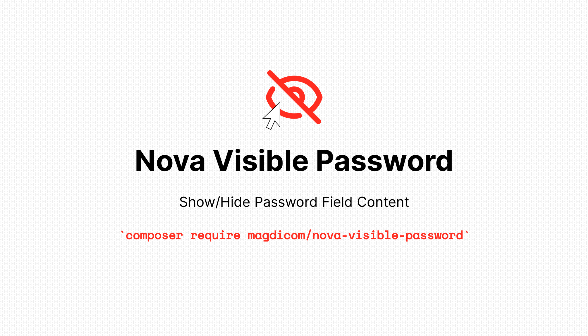
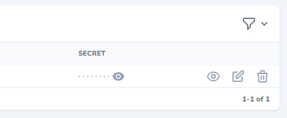

---

[](https://packagist.org/packages/magdicom/nova-visible-password)
[?style=flat-square)]([https://packagist.org/packages/sentq/laravel-sentq](https://packagist.org/packages/magdicom/nova-visible-password))


A Laravel Nova password field with a visibility toggle, its behaviour typical as the built-in password field, but with added features that you may find useful in certain use cases.

### Features:
+ it can safely replace the built-in password field.
+ Enable the toggle button in index and/or detail.
+ Disable the toggle button in forms.
+ Render the field with data.
+ Disable data encryption/hash.
----

1. [Requirements](https://github.com/magdicom/nova-visible-password#requirements)
2. [Installation](https://github.com/magdicom/nova-visible-password#installation)
3. [Usage](https://github.com/magdicom/nova-visible-password#usage)
    1. [Basic usage](https://github.com/magdicom/nova-visible-password#basic-usage)
    2. [Disable data encryption (Hash)](https://github.com/magdicom/nova-visible-password#disable-data-encryption)
    3. [Populate with data](https://github.com/magdicom/nova-visible-password#populate-field-with-data)
    4. [Disable toggle button on forms](https://github.com/magdicom/nova-visible-password#disable-toggle-button-on-forms)
    5. [Visible on resource index](https://github.com/magdicom/nova-visible-password#enable-toggle-button-on-index)
    6. [Visible on resource detail](https://github.com/magdicom/nova-visible-password#enable-toggle-button-on-detail)
4. [License](https://github.com/magdicom/nova-visible-password#license)

<a name="requirements"></a>
## Requirements

- `php: ^8`
- `laravel/nova: ^4`

<a name="installation"></a>
## Installation

You can install the package in to a Laravel app that uses [Nova](https://nova.laravel.com) via composer:

```bash
composer require magdicom/nova-visible-password
```

<a name="usage"></a>
## Usage

<a name="basic-usage"></a>
### Basic Usage


Using the field is simple, just like any other Nova built-in field.

```php
// in app/Nova/Resources/User.php

use Magdicom\NovaVisiblePassword\VisiblePassword;

class User extends Resource
{
    
    public function fields(Request $request)
    {
       return [
         VisiblePassword::make('Password')
      ];
    }
 }
```

<a name="hash-on-save"></a>
### Disable Data Encryption

The default behaviour of the password field is to encrypt the data when saving it using Laravel `Hash` class, to disable this functionality you simply need to call the `hashOnSave` method which accepts a boolean or callback:

```php
VisiblePassword::make('Password')->hashOnSave(false),
```

<a name="populate-with-data"></a>
### Populate Field With Data

Normally password fields would populate/displayed empty, but in some cases you may need these data to be present, use the `withValue` method which accepts a boolean or callback:

```php
VisiblePassword::make('Password')->withValue(true),
```

<a name="visible-on-forms"></a>
### Disable Toggle Button On Forms

You can disable the toggle button on create/update forms per field using `visibleOnForms` method:

```php
VisiblePassword::make('Password')
    ->visibleOnForms(function(){
        // your logic here
        return false;
    }),
```
* The methods `visibleOnForms`, `visibleOnIndex` and `visibleOnDetail` accepts boolean value or a callback.

<a name="visible-on-index"></a>
### Enable Toggle Button On Index

Optionally you can enable the toggle button on resource index page:

```php
VisiblePassword::make('Password')->visibleOnIndex(),
```



<a name="visible-on-detail"></a>
### Enable Toggle Button On Detail

Also you can enable the toggle button on resource detail page:

```php
VisiblePassword::make('Password')->visibleOnDetail(),
```


<a name="license"></a>
## License

The MIT License (MIT). Please see [License File](LICENSE.md) for more information.
